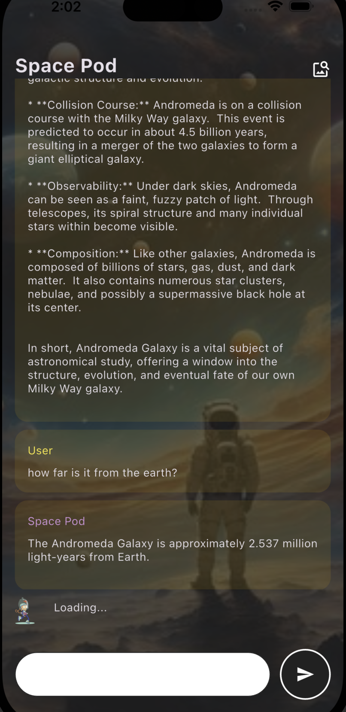

# Chat_Bot

## Overview
Chat_Bot is a dynamic conversational AI application developed using Flutter, seamlessly integrating Google Gemini. The app offers intelligent, human-like interactions, leveraging advanced AI capabilities to deliver a seamless and responsive user experience. Inspired by the functionality of Google’s Gemini, Chat_Bot is designed to redefine the standards of conversational AI.

---

## Features
- **Intelligent Conversations**: Chat_Bot mimics natural human dialogue for an engaging user experience.
- **Google Gemini Integration**: Harnesses cutting-edge AI technology for smarter, more adaptive responses.
- **Cross-Platform Compatibility**: Built using Flutter, ensuring smooth performance on both Android and iOS.
- **User-Friendly Interface**: Clean, modern UI for intuitive navigation and interaction.

---

## Technology Stack
- **Framework**: [Flutter](https://flutter.dev/)
- **AI Engine**: [Google Gemini](https://cloud.google.com/gemini)
- **Programming Languages**: Dart, with additional support for native platform integrations if required.

---

## Installation
Follow these steps to set up the Chat_Bot app on your local environment:

### Prerequisites
- Flutter SDK installed ([Installation Guide](https://flutter.dev/docs/get-started/install))
- Dart SDK included with Flutter setup
- Google Cloud API credentials for Gemini integration

### Steps
1. Clone the repository:
   ```bash
   git clone https://github.com/your-username/chat_bot.git
   ```
2. Navigate to the project directory:
   ```bash
   cd chat_bot
   ```
3. Install dependencies:
   ```bash
   flutter pub get
   ```
4. Set up Google Gemini credentials in the project:
   - Add your API keys and configuration details to the `assets/config.json` or appropriate configuration file.

5. Run the app:
   ```bash
   flutter run
   ```

---

## Usage
- Launch the app on your device or emulator.
- Start a conversation by typing your queries into the input field.
- Experience real-time, intelligent, and context-aware responses powered by Google Gemini.

---

## Screenshots



---

## Contributing
We welcome contributions! To contribute:
1. Fork the repository.
2. Create a feature branch:
   ```bash
   git checkout -b feature/your-feature-name
   ```
3. Commit your changes and push to the branch:
   ```bash
   git commit -m "Add your commit message"
   git push origin feature/your-feature-name
   ```
4. Open a pull request on the main repository.

---

## License
This project is licensed under the [MIT License](LICENSE).

---

## Acknowledgments
- [Flutter](https://flutter.dev/) for its powerful UI framework.
- [Google Cloud Platform](https://cloud.google.com/) for providing the Gemini API.
- Open-source libraries and contributors.

---

Feel free to explore, use, and enhance Chat_Bot for your own projects. Together, let’s push the boundaries of conversational AI!
